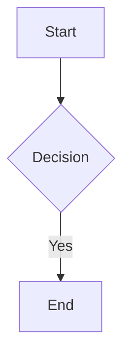

# Obsidian Flavored Markdown

## When to use
When creating or editing content in Obsidian Flavored Markdown format.

## How

### Wikilinks (Internal Links)
- `[[Note Name]]` — link to note
- `[[Note Name|Display Text]]` — custom text
- `[[Note Name#Heading]]` — link to heading
- `[[Note Name#^block-id]]` — link to block

### Embeds
- `![[Note Name]]` — embed full note
- `![[Note Name#Heading]]` — embed section
- `![[image.png]]` — embed image
- `![[image.png|300]]` — embed with width
- `![[document.pdf#page=3]]` — embed PDF page

### Callouts
```
> [!note] Title
> Basic callout content.

> [!warning] Custom Title
> Warning content.

> [!faq]- Collapsed
> Foldable callout (- collapsed, + expanded).
```
Types: note, tip, warning, info, example, quote, bug, danger, success, failure, question, abstract, todo.

### Tags
- `#tag` — inline tag
- `#nested/tag` — hierarchical tag
- Also in frontmatter: `tags: [tag1, nested/tag]`

### Comments
`%% Hidden text %%` — invisible in reading view.

### Highlighting
`==highlighted text==`

### Math (LaTeX)
- Inline: `$formula$`
- Block: `$$formula$$`

### Mermaid Diagrams
````

````

### Footnotes
```
Text with footnote[^1].

[^1]: Footnote content.
```
